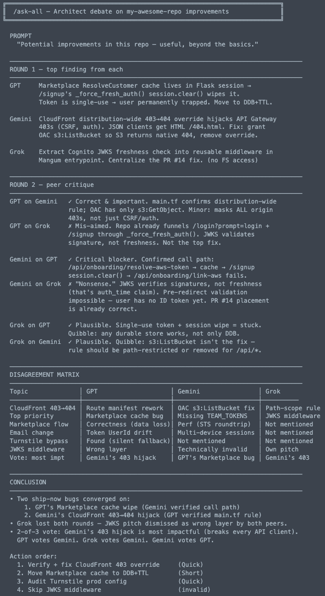
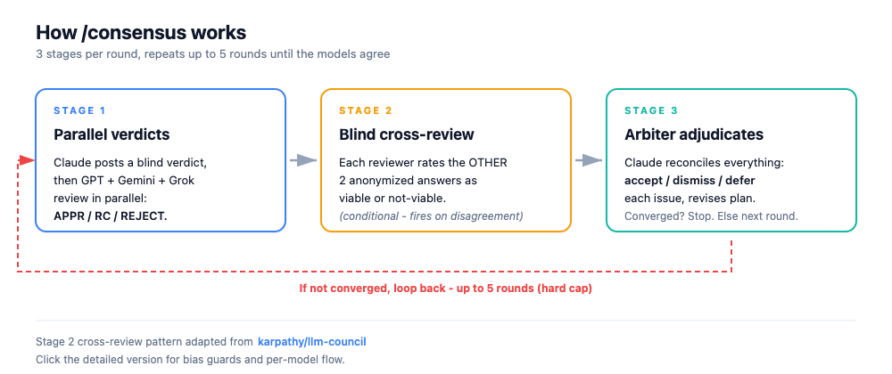

# Deliberation

Get a second opinion in Claude Code from GPT, Gemini, and Grok - plus 300+ more models through OpenRouter, including Qwen, Kimi, and DeepSeek. Seven domain experts (Architect, Code Reviewer, Security Analyst, and four more) review your plans, find bugs, and debate edge cases until they agree.

[<br>One model is a guess. Three that agree is a plan. → read the blog post](https://builder.aws.com/content/3DtBiR4ua0qy7ybZMPzPmQ2SDMj/one-model-is-a-guess-three-that-agree-is-a-plan)

<details>
<summary>📸 See a full <code>/consensus</code> run: round 1 disagreement to round 5 convergence</summary>


<details>
<summary>... a few moments later ...</summary>


</details>


</details>

<details>
<summary>📸 See <code>/ask-all</code> stage a 2-round architect debate: three models, three verdicts, then each critiques the others - disagreement matrix included</summary>



When three models argue, the real bug reveals itself. Round 1 = independent top findings. Round 2 = each model dunks on the others' picks. The disagreement matrix shows where they diverge; the conclusion shows what to actually fix first.

</details>

## What is Deliberation?

Claude can ask GPT, Gemini, Grok, or any OpenAI-compatible model (via OpenRouter) for help
through MCP. The plugin handles the wiring for each provider so you just write the prompt.
Each expert has a distinct specialty and can advise or implement.

You can use any subset of the providers. The plugin detects which are configured and routes
accordingly. OpenRouter is advisory-only and config-driven: models are declared in
`~/.config/deliberation/config.json` (Windows: `%APPDATA%\deliberation\config.json`; override
with `DELIBERATION_CONFIG`) and hot-reload without restarting Claude Code.

| What you get | Why it matters |
|--------------|----------------|
| 7 domain experts | The right specialist for each problem type |
| GPT, Gemini, Grok, or OpenRouter models | Use your preferred provider(s) |
| Dual mode | Experts analyze (read-only) or implement (write) |
| Auto-routing | Claude detects when to delegate from your request |
| Synthesized responses | Claude interprets expert output, never raw passthrough |

## Install

### Claude Code plugin (recommended):

**1. Add the marketplace - [antonbabenko/agent-plugins](https://github.com/antonbabenko/agent-plugins)**
```
/plugin marketplace add antonbabenko/agent-plugins
```

**2. Install the plugin**
```
/plugin install deliberation@antonbabenko
```

**3. Run setup**
```
/deliberation:setup
```

Claude now routes complex tasks to your GPT, Gemini, Grok, and OpenRouter experts (Grok and OpenRouter advise; GPT and Gemini can also implement).

### Alternative: Use `deliberation` MCP server (standalone, works with any agents)

The orchestration server is also published on its own - npm [`@antonbabenko/deliberation-mcp`](https://www.npmjs.com/package/@antonbabenko/deliberation-mcp), Official MCP Registry name `io.github.antonbabenko/deliberation`.

**One-click install:**

[](https://cursor.com/en-US/install-mcp?name=deliberation&config=eyJjb21tYW5kIjoibnB4IiwiYXJncyI6WyIteSIsIkBhbnRvbmJhYmVua28vZGVsaWJlcmF0aW9uLW1jcCJdfQ==) [](https://insiders.vscode.dev/redirect/mcp/install?name=deliberation&config=%7B%22command%22%3A%22npx%22%2C%22args%22%3A%5B%22-y%22%2C%22%40antonbabenko%2Fdeliberation-mcp%22%5D%7D) [](https://kiro.dev/launch/mcp/add?name=deliberation&config=%7B%22command%22%3A%22npx%22%2C%22args%22%3A%5B%22-y%22%2C%22%40antonbabenko%2Fdeliberation-mcp%22%5D%7D)

<details>
<summary>Manual config for any MCP clients</summary>

Add this to your host's MCP config (most hosts use the `mcpServers` key):

```json
{
  "mcpServers": {
    "deliberation": {
      "command": "npx",
      "args": ["-y", "@antonbabenko/deliberation-mcp"],
      "env": {
        "XAI_API_KEY": "xai-...",
        "OPENROUTER_API_KEY": "sk-or-v1-..."
      }
    }
  }
}
```

The `env` block is how you set provider keys outside Claude Code. GPT and Gemini do not read keys here - they use the `codex` and `agy` CLIs (logged in separately), so drop those lines if you only use GPT/Gemini. `XAI_API_KEY` enables Grok; `OPENROUTER_API_KEY` enables OpenRouter (which also needs models declared in `~/.config/deliberation/config.json` - the canonical XDG path, Windows `%APPDATA%\deliberation\config.json` - or point elsewhere with `DELIBERATION_CONFIG`). The one-click buttons above cannot carry secrets - add the `env` block by hand after installing.

Per-host config location and the key it expects:

| Host | Config | Key |
|------|--------|-----|
| Claude Code | `claude mcp add deliberation -- npx -y @antonbabenko/deliberation-mcp` (or project `.mcp.json`) | `mcpServers` |
| Claude Desktop | `~/Library/Application Support/Claude/claude_desktop_config.json` (macOS), `%APPDATA%\Claude\claude_desktop_config.json` (Windows) | `mcpServers` |
| Cursor | `~/.cursor/mcp.json` (global) or `.cursor/mcp.json` (project) | `mcpServers` |
| VS Code | `.vscode/mcp.json` - note: each entry needs `"type": "stdio"` | `servers` |
| Codex CLI | `~/.codex/config.toml` - TOML, e.g. `[mcp_servers.deliberation]` | `mcp_servers` |
| Gemini CLI | `~/.gemini/settings.json` | `mcpServers` |
| Windsurf | `~/.codeium/windsurf/mcp_config.json` | `mcpServers` |
| Zed | `settings.json` | `context_servers` |
| Cline | the extension's MCP settings (Cline panel -> MCP Servers) | `mcpServers` |

Provider prerequisites are the same as the plugin (see [Requirements](#requirements)): the Codex CLI for GPT, `agy` for Gemini, `XAI_API_KEY` for Grok, and `OPENROUTER_API_KEY` plus `~/.config/deliberation/config.json` for OpenRouter (Windows: `%APPDATA%\deliberation\config.json`; override the config path with `DELIBERATION_CONFIG`).

Tools exposed: `ask-all`, `consensus`, `ask-gpt` / `ask-gemini` / `ask-grok` / `ask-openrouter`, and the seven experts (`architect`, `plan-reviewer`, `scope-analyst`, `code-reviewer`, `security-analyst`, `researcher`, `debugger`).

The package also ships a `deliberation-setup` bin. Run it once with `npx -y --package @antonbabenko/deliberation-mcp deliberation-setup` to write a starter `~/.config/deliberation/config.json` (it never overwrites an existing one). The plain `npx -y @antonbabenko/deliberation-mcp` form runs the default bin (the server), which is what your MCP host launches. For host rule wiring, see [`AGENTS.md`](AGENTS.md) and the per-host snippets in [`examples/`](examples/).

</details>

### Native plugins per host (Cursor / Codex / Kiro / OpenCode)

Beyond the raw MCP config above, deliberation ships **native plugin artifacts** for four hosts so the experience matches the Claude Code plugin (persona-bearing experts + when-to-delegate guidance, not just bare tools). All of these are **generated from the canonical sources** by `node scripts/sync-hosts.js` and committed, so they never drift (a CI drift test enforces it). Each host scans the repo for its own files:

| Host | Native artifacts (in this repo) | Install |
|------|----------------------------------|---------|
| **Cursor** | `.cursor/rules/deliberation.mdc` | Use the one-click MCP button above, then copy the `.mdc` into your project's `.cursor/rules/`. |
| **Codex CLI** | `plugins/deliberation/` (`.codex-plugin/plugin.json` + `.mcp.json` + `skills/`) and a repo-scoped `.agents/plugins/marketplace.json` | `codex plugin marketplace add antonbabenko/deliberation`, then install **deliberation** from `/plugins`. |
| **Kiro** | `POWER.md` + `mcp.json` + `steering/` (a "Kiro Power") | In Kiro, "Add power from GitHub" -> this repo URL. Submit to the registry at [kiro.dev/powers/submit](https://kiro.dev/powers/submit/). |
| **OpenCode** | `.opencode/commands/*.md` + `.opencode/agents/*.md` | Add the MCP server to `opencode.json` (`mcp` key, `type: "local"`, `command: ["npx","-y","@antonbabenko/deliberation-mcp"]`), then copy `.opencode/commands/` and `.opencode/agents/` into your project. |

Provider credentials work the same as the standalone server (GPT via the Codex CLI, Gemini via `agy`, `XAI_API_KEY` for Grok, `OPENROUTER_API_KEY` for OpenRouter) - set only the providers you use. The MCP server already injects each expert persona server-side, so these native files add the host's command/steering surface, not duplicated logic.

**Full per-host install guides:** [`public-docs/hosts/`](public-docs/hosts/) - [Cursor](public-docs/hosts/cursor.md), [Codex CLI](public-docs/hosts/codex.md), [Kiro](public-docs/hosts/kiro.md), [OpenCode](public-docs/hosts/opencode.md).

## Requirements

You need at least one provider:

- **Codex CLI** (GPT): `npm install -g @openai/codex`, then `codex login`.
- **Antigravity CLI**: [Getting Started with Antigravity CLI](https://antigravity.google/docs/cli-getting-started) and [Migrating from Gemini CLI](https://antigravity.google/docs/gcli-migration), then run `agy` and login.
- **Grok (xAI)**: no CLI to install; the bridge ships with the plugin (needs Node 18+). Set `XAI_API_KEY` (get a key at https://console.x.ai).
- **OpenRouter**: no CLI; the bridge ships with the plugin (needs Node 18+). Set `OPENROUTER_API_KEY` (get a key at https://openrouter.ai/keys), then declare models in `~/.config/deliberation/config.json` (Windows: `%APPDATA%\deliberation\config.json`; override with `DELIBERATION_CONFIG`). Works with any OpenAI-compatible endpoint (Ollama, vLLM, LM Studio, HuggingFace Inference) - auth is skipped automatically when the key env var is empty.

## Commands

Bundled with the plugin (available once installed):

| Command | Purpose |
|---------|---------|
| `/deliberation:setup` | Configure Codex/Gemini/Grok/OpenRouter MCP servers + orchestration rules |
| `/deliberation:consensus` | 🔥🔥🔥 Arbiter-mediated GPT + Gemini + Grok + Claude convergence loop |
| `/deliberation:ask-all` | 🔥 GPT + Gemini + Grok (+ configured OpenRouter models) in parallel, synthesized |
| `/deliberation:ask-gpt` | One-shot GPT (Codex) second opinion |
| `/deliberation:ask-gemini` | One-shot Gemini second opinion |
| `/deliberation:ask-grok` | One-shot Grok (xAI) second opinion (advisory-only) |
| `/deliberation:ask-openrouter` | One-shot OpenRouter model second opinion (advisory-only) |
| `/deliberation:uninstall` | Remove MCP config, rules, and aliases |
| `/deliberation:grok-files` | List, prune, or gc Grok-uploaded files (storage + local cache cleanup) |

`/setup` can also install short aliases (`/ask-gpt`, `/ask-gemini`, `/ask-grok`, `/ask-all`, `/consensus`, `/grok-files`) into `~/.claude/commands/`. This is opt-in. Existing same-named commands are kept by default; setup asks before overwriting any of them. `/uninstall` removes an alias only if it is byte-identical to the bundled copy.

## The Experts

| Expert | What they do | Example triggers |
|--------|--------------|------------------|
| **Architect** | System design, tradeoffs, complex debugging | "How should I structure this?" / "What are the tradeoffs?" |
| **Plan Reviewer** | Validate plans before you start | "Review this migration plan" / "Is this approach sound?" |
| **Scope Analyst** | Catch ambiguities early | "What am I missing?" / "Clarify the scope" |
| **Code Reviewer** | Find bugs, improve quality | "Review this PR" / "What's wrong with this?" |
| **Security Analyst** | Vulnerabilities, threat modeling | "Is this secure?" / "Harden this endpoint" |
| **Researcher** | External libraries, docs, best practices | "How do I use X?" / "Find examples of Y" |
| **Debugger** | Root-cause analysis, minimal fixes | "Why does this crash?" / "Debug this failing test" |

### When experts help most

- **Architecture decisions** - "Should I use Redis or in-memory caching?"
- **Stuck debugging** - after two or more failed attempts, get a fresh perspective
- **Pre-implementation** - validate a plan before writing code
- **Security concerns** - "Is this auth flow safe?"
- **Code quality** - a second opinion on your implementation

### When not to use experts

- Simple file operations (Claude handles these directly)
- First attempt at any fix (try yourself first)
- Trivial questions (no need to delegate)

## How to Use

Describe your task. Claude detects when an expert helps and delegates automatically:

```
You: "Is this authentication flow secure?"
Claude: routes to the Security Analyst, then synthesizes the findings.
```

You can also ask explicitly: "Ask GPT to review this architecture", "Ask Gemini to...", or "Ask Grok to...". Each expert runs read-only for analysis or with write access to apply fixes, and Claude picks the mode from your request.

Or invoke the slash commands directly - see Commands above.

## How /consensus and /ask-* keep models honest

`/ask-gpt`, `/ask-gemini`, `/ask-grok`, and `/ask-all` are the quick commands: each dispatches one or three external models, Claude reads the output, and you get one synthesized answer. Single shot, no loop, no peer round.

`/consensus` is the heavy one. Same parallel dispatch, but with a peer-review round and a multi-round loop that stops only when the models agree. The cost: the orchestrator (Claude) writes the review prompt, casts a vote, decides which objections are real, and runs the loop. Left alone, that setup can quietly rubber-stamp its own plan. Four guards stop that.



[See the detailed diagram with bias guards and per-model flow](assets/consensus-flow.png)

The four guards:

- **Blind verdict.** Claude posts its own verdict (APPROVE / REQUEST CHANGES / REJECT) in a message sent *before* the one that calls the panel. The pre-commitment sits in the transcript, so Claude cannot reshape its opinion after seeing the others.
- **Peer review.** Stage 2: each external model rates the OTHER models' answers blind, with identity stripped best-effort. Not-viable votes become candidate critical issues for the arbiter to weigh. Pattern adapted from [karpathy/llm-council](https://github.com/karpathy/llm-council).
- **No self-approval.** A round converges only when every responding external approves and at least one external actually answered. Claude's own approval never carries a round by itself. A provider that errors (an unconfigured Grok returning `missing-auth`, for example) drops out of the count instead of jamming the loop.
- **No silent dismissal.** Every critical issue that gets dismissed or deferred ships with a one-line reason in the final report, including the times Claude walks back one of its own blind objections.

The `/ask-*` commands carry a lighter version of the same rule. The external model only advises: Claude reads the output, applies its own judgment, and owns the synthesized answer. When the models agree, that is input, not a verdict.

<details>
<summary>Deep dive: how a single /consensus round actually runs</summary>

Each `/consensus` round runs three stages:

1. **Stage 1 - parallel verdicts.** Claude commits a blind verdict first; GPT, Gemini, and Grok review the plan in parallel and emit APPROVE / REQUEST CHANGES / REJECT plus a list of critical issues.
2. **Stage 2 - blind cross-review (conditional).** Each external reviewer rates the OTHER reviewers' anonymized answers as viable or not-viable, with a one-line reason and a category. Reviewer identity is stripped best-effort (preamble plus self-references). House styles may still leak, so reviewers are instructed to score substance, not style. Not-viable votes become candidate critical issues for Stage 3.
3. **Stage 3 - arbiter adjudication.** Claude reconciles Stage 1 verdicts, Stage 2 candidate issues, and its own blind verdict. For each issue it picks accept, dismiss (with reason), or defer. Then it revises the plan for the next round.

The loop stops when all responding externals approve, zero critical issues remain accepted, and Claude adjudicates APPROVE. Hard cap at 5 rounds.

**Stage 2 trigger.** Round 1 always. Round 2 onwards, Stage 2 fires only when Stage 1 has divergence OR the previous Stage 2 surfaced an arbiter-accepted not-viable issue (a one-round lookback that catches rubber-stamp convergence after a divergent round).

**Stage 2 activation boundary.** Stage 2 is skipped on `sandbox: workspace-write` runs (Claude is writing code, not reviewing prose). Plan reviews that merely contain embedded diff text as prose still run Stage 2.

**Cost ceiling.** Stage 2 adds at most about 60% to the call count in the worst case (5 rounds, Stage 2 firing every round). Typical convergence (2 to 3 rounds with partial Stage 2 fires) adds 25 to 50%.

Scoring vocabulary and operator-visible debug details live in [TECHNICAL.md](TECHNICAL.md#consensus-flow-details).

</details>

## Configuration

Every expert supports two modes, chosen automatically from your request:

| Mode | Sandbox | Use when |
|------|---------|----------|
| Advisory | `read-only` | Analysis, recommendations, reviews |
| Implementation | `workspace-write` | Making changes, fixing issues |

### OpenRouter config

OpenRouter models are declared in `~/.config/deliberation/config.json` - the canonical
XDG path (Windows: `%APPDATA%\deliberation\config.json`). You can override the path
with `DELIBERATION_CONFIG`. The file is the live single source of
truth: changes to `models`, `routing`, or the `providers.openrouter` block hot-reload
without restarting Claude Code. Toggling a built-in provider (codex / gemini / grok)
still requires `/setup`.

The config has four sections: `providers` (transport / connection per provider),
`models` (named model records keyed by id), `routing` (fan-out policy), and
`consensus.arbiter` (who synthesizes the verdict). The `$schema` key gives editors
validation and autocomplete - VS Code needs no extension.

Minimal example:

```json
{
  "$schema": "https://raw.githubusercontent.com/antonbabenko/deliberation/master/config/config.schema.json",
  "version": 1,
  "providers": {
    "codex":  { "enabled": true },
    "gemini": { "enabled": true },
    "grok":   { "enabled": true, "apiKeyEnv": "XAI_API_KEY" },
    "openrouter": {
      "enabled": true,
      "apiKeyEnv": "OPENROUTER_API_KEY",
      "apiBase": "https://openrouter.ai/api/v1",
      "defaultModel": "openai/gpt-4.1-mini",
      "defaults": { "reasoningEffort": "medium" }
    }
  },
  "models": {
    "gpt-4-or": {
      "provider": "openrouter",
      "model": "openai/gpt-4.1",
      "askAll": true,
      "consensus": false
    },
    "claude-arb": {
      "provider": "openrouter",
      "model": "anthropic/claude-haiku-4-5",
      "askAll": true,
      "consensus": true,
      "reasoningEffort": "high"
    }
  },
  "routing": { "maxFanout": 3 },
  "consensus": { "arbiter": { "model": "claude-arb" } }
}
```

Browse model slugs at [openrouter.ai/models](https://openrouter.ai/models?input_modalities=text);
the `model` field takes any slug listed there. Each record's `provider` must be
`"openrouter"` in v1 (codex / gemini / grok are managed by their own CLI / API).

`reasoningEffort` (`low` / `medium` / `high`) sets how hard a reasoning model
thinks. Put it on `providers.openrouter.defaults` to cover every model, or on a single
record to override the default for that one. Precedence runs call argument over
per-record override over `defaults`.

`/ask-all` includes records where `askAll !== false`, capped to `routing.maxFanout`.
`/consensus` includes records where `consensus === true`, with no fanout cap (a warning
is emitted when more than 3 models participate). `consensus.arbiter` picks who synthesizes:
a shorthand string (`"auto"` / `"host"` / `"codex"` / `"gemini"` / `"grok"`) or
`{ "model": "<id>" }` naming a record (even an out-of-panel one). Implementation tasks
always route to Codex or Gemini - never OpenRouter.

For the full schema, the `$schema` / VS Code validation story, apiBase override matrix
(Ollama, vLLM, LM Studio, HuggingFace), file-attachment caps, session model persistence,
consensus cost model, and error kinds, see
[TECHNICAL.md - OpenRouter bridge](TECHNICAL.md#openrouter-bridge).

For provider defaults, environment variables, and manual MCP setup, see [TECHNICAL.md](TECHNICAL.md#environment-variables).

## Upgrade from 1.x (claude-delegator -> deliberation)

2.0 renames the plugin and drops 1.x compatibility. One-time steps:

1. Move your config to the canonical path: `mkdir -p ~/.config/deliberation && mv
   ~/.claude/claude-delegator/config.json ~/.config/deliberation/config.json` (or set
   `DELIBERATION_CONFIG` to a custom path; `CLAUDE_DELEGATOR_CONFIG` is no longer read).
2. Re-run `/deliberation:setup` to register the renamed MCP servers. The old bare
   `codex`/`gemini`/`grok`/`openrouter` registrations are not auto-removed. If you had them,
   remove each one (the CLI takes one name per call):
   ```
   claude mcp remove --scope user codex
   claude mcp remove --scope user gemini
   claude mcp remove --scope user grok
   claude mcp remove --scope user openrouter
   ```
3. Slash commands moved from `/claude-delegator:*` to `/deliberation:*` (the short aliases
   `/ask-gpt` etc. are unchanged).
4. Optional cleanup: `rm -rf ~/.claude/rules/delegator ~/.claude/cache/claude-delegator`.
5. Restart Claude Code.

## Author

Maintained by Anton Babenko - [LinkedIn](https://linkedin.com/in/antonbabenko), [X/Twitter](https://x.com/antonbabenko).

## Contributing

Contributions welcome. See [CONTRIBUTING.md](CONTRIBUTING.md) for the workflow, commit conventions, and the automated release process. 

## Credits

Deliberation started as a fork of [jarrodwatts/claude-delegator](https://github.com/jarrodwatts/claude-delegator) - credit to Jarrod Watts for the original solution and inspiration. Original work and MIT copyright are retained. This fork adds Grok support, Gemini bridge reliability (timeout and trust recovery), provider configuration overrides, and the bundled delegation commands. It is not an official continuation of the upstream project.

Expert prompts are adapted from [oh-my-openagent](https://github.com/code-yeongyu/oh-my-openagent) (snapshot `03eb9fff`, 2026-05-25) and [PAL MCP server](https://github.com/BeehiveInnovations/pal-mcp-server) (Apache-2.0, snapshot `7afc7c1`, 2026-05-25).

## License

[MIT](LICENSE)
